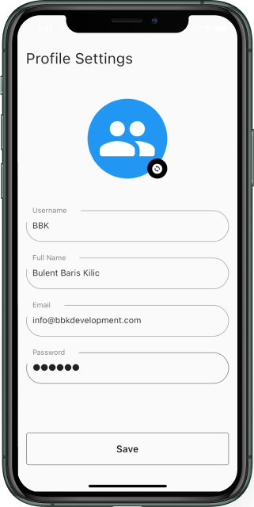
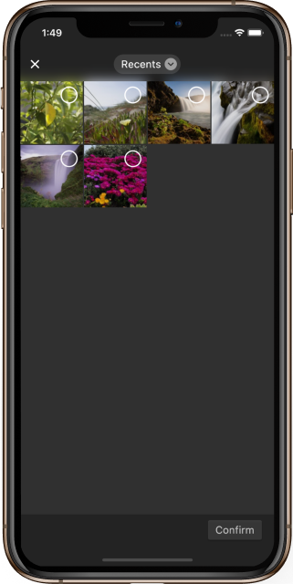

# <p align="center">EditableImage Flutter Package</p> 

[Flutter](https://flutter.dev/) package for creating a fully customizable and editable image widget. The package written solely in [Dart Language](https://dart.dev/).

&nbsp;

## Features

A powerful and fully customizable widget. It provides a custom widget to save time.

For example, almost in every `profile settings` interface, etc., there is a profile image. Instead of writing from scratch, this widget can be used and can save a lot of time.

&nbsp;

<p align="center">&nbsp;&nbsp;</p>

&nbsp;

<p align="center">&nbsp;</p>

&nbsp;

## Getting started

Let's take a look at how to implement `EditableImage` to fastly create user interfaces for profile picture edit, etc.

Firstly, add following line to `pubspec.yaml`:
```yaml
editable_image: ^0.1.0
```

Second, import `EditableImage`:
```dart
import 'package:editable_image/editable_image.dart';
```

Lastly, make platform-specific setups by applying the following instructions.

### iOS Setup

- Platform version must be at least 9.0. Please modify `ios/Podfile` and update accordingly:
```ruby
platform :ios, '9.0'
```

- Add the following lines to `ios/Runner/Info.plist`:
```plist
<key>NSPhotoLibraryUsageDescription</key>
<string>Put here your permission description.</string>
```

### Android Setup

Required permissions: INTERNET, READ_EXTERNAL_STORAGE.

If you found some warning logs with Glide appearing, then the main project needs an implementation of `AppGlideModule`. See [Generated API](https://sjudd.github.io/glide/doc/generatedapi.html).

### macOS Setup

- Platform version must be at least 10.15. Please modify `macos/Podfile` and update accordingly:
```ruby
platform :osx, '10.15'
```

- Please set the minimum deployment target to 10.15. Use XCode to open `macos/Runner.xcworkspace`:

- Follow the iOS instructions and modify `ios/Runner/Info.plist` accordingly.

&nbsp;

## Usage

TODO: Include short and useful examples for package users. Add longer examples
to `/example` folder. 

```dart
const like = 'sample';
```

&nbsp;

## Example

TODO: Include short and useful examples for package users. Add longer examples
to `/example` folder. 

```dart
const like = 'sample';
```

&nbsp;

## Additional information

TODO: Tell users more about the package: where to find more information, how to 
contribute to the package, how to file issues, what response they can expect 
from the package authors, and more.

&nbsp;

## Feature requests and bugs

Please file feature requests and bugs at the [issue tracker](https://github.com/BBarisKilic/Editable-Image/issues).

&nbsp;

## Maintainers

- [Bulent Baris Kilic](https://github.com/BBarisKilic)